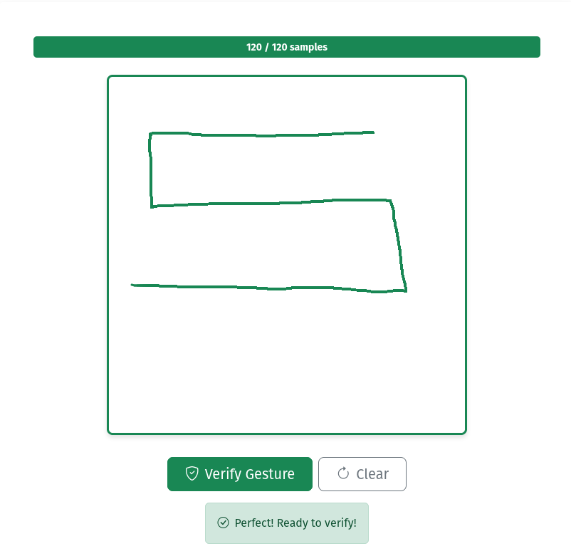
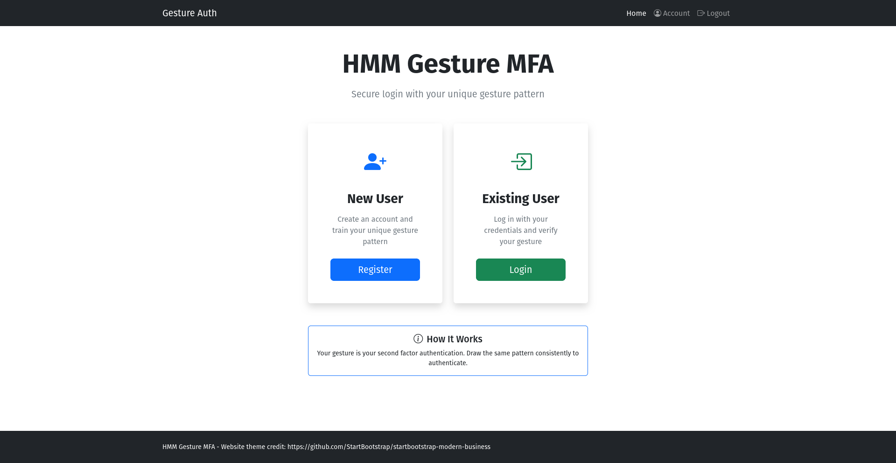
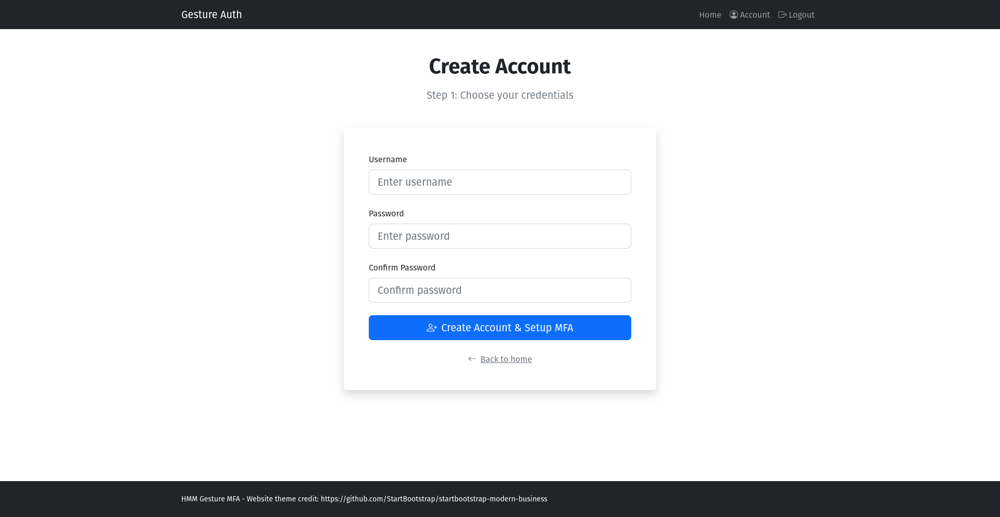
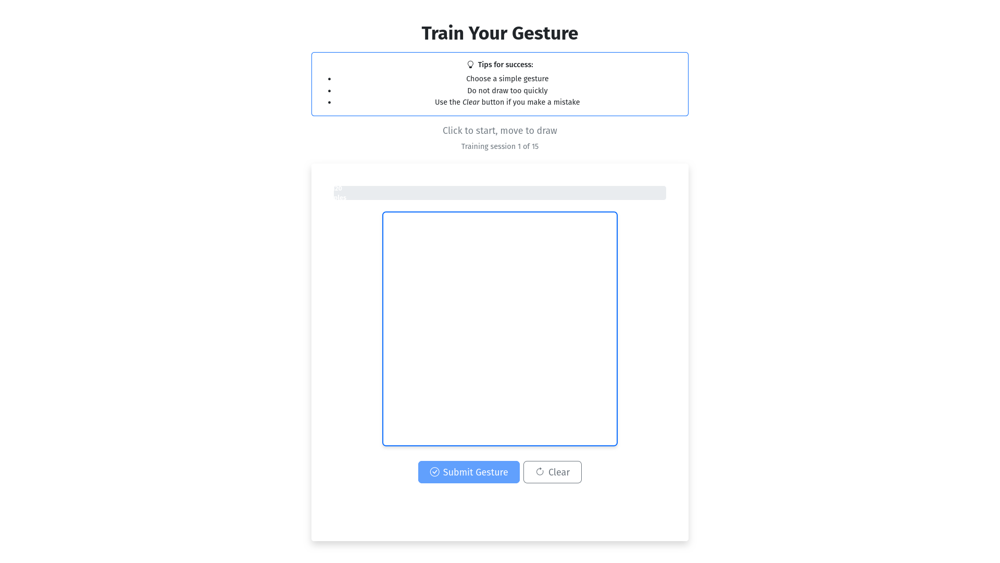

# HMM Gesture MFA

By: _Jstith_

This project is a proof-of-concept exploring the viability of using Hidden Markov Models (HMMs) to model a unique user gesture as a form of multi-factor authentication (MFA). The project extends a traditional login page by having users create a unique, secret gesture several times, and modeling that gestures as an HMM. This allows users to draw their gesture when logging in, and verify their gesture against the HMM to successfully pass authentication.


**Disclaimer:** I made this project for two reasons: to learn more about HMMs, and for a CTF challenge. This project in its current form is *not* sufficiently difficult to defeat to be used for real world authentication. Also I recognize that a password and hidden gesture is poor MFA (something you know + something you know).

## Contents

- [Install](#install)
- [Overview](#overview)
- [How it Works](#how-it-works)
  - [Flask App](#flask-app)
  - [Hidden Markov Model Implementation](#hidden-markov-model-implementation)
    - [Getting User Data](#getting-user-data)
    - [Data Quantization](#data-quantization)
    - [Tune the number of hidden states](#tune-the-number-of-hidden-states)
    - [K-Fold validation](#k-fold-validation)
    - [Scoring the HMM](#scoring-the-hmm)
    - [Calculating Equal Error Rate (EER) & Validation Threshold](#calculating-equal-error-rate-eer--validation-threshold)


## Install

This project is written entirely in Python. To run the code, simply clone the repository, install the requirements with pip, and run the entry script `app.py`.

```
git clone https://github.com/Jstith/HMM-Signature-MFA.git
cd HMM-Signature-MFA
# recommended: python3 -m venv venv && source venv/bin/activate
pip install -r requirements.txt
python3 app.py
```

The program has a pre-loaded user with credentials `test:test` and a trained gesture that looks like this:



## Overview

This project has two main components, a flask app and a python-based HMM implementation. The flask app (app.py) performs basic authentication and session handling, and the HMM implementation (hmm.py) performs all the gesture-focused model creation, tuning, and validation.

```
HMM-LoginPage/
└── new_app/
    ├── app.py                     # Main Flask application with routes and auth
    ├── config.py                  # Configuration parameters for HMM and frontend
    ├── hmm.py                     # HMM model training, verification, and analysis
    ├── users.py                   # User management (registration, login, MFA status)
    │
    ├── templates/                 # HTML templates (Bootstrap themed)
    │   ├── base.html              # Base template with navbar
    │   ├── landing.html           # Landing page (register/login options)
    │   ├── register.html          # User registration form
    │   ├── login.html             # User login form
    │   ├── train.html             # Gesture training (MFA setup)
    │   ├── verify.html            # Gesture verification (MFA check)
    │   └── success.html           # Successful authentication page
    │
    ├── data/                      # User data storage
    │   └── users.json             # User credentials and MFA status
    │
    ├── models/                    # Trained HMM models (per-user)
    │   └── {username}_model.pkl   # User-specific gesture model
    │
    └── helper/                    # Helper data
        └── impostor_library.json  # Impostor gesture data for EER calculation
```

## How it Works

### Flask App

When a user visits the home page, they are given options to create an account or sign in to an existing account.



When a user creates a new account, they begin by entering a standard username and password.



Once they have registered, a user must enter their unique gesture to create an HMM representing it.



Users create their gesture by clicking and drawing on the page. They must submit their gesture 15 times in order to adequately train the model. Once training is complete, they will be asked to validate their MFA to authenticate to the site.

### Hidden Markov Model Implementation

#### Getting User Data

When the user draws their gestures, a web socket sends the gesture data to the back end in a collection of {X, Y, timestamp} sets.

```
{'x': 16, 'y': 237, 'timestamp': 1766854181071},
{'x': 16, 'y': 226, 'timestamp': 1766854181098},
{'x': 19, 'y': 214, 'timestamp': 1766854181130},
{'x': 22, 'y': 203, 'timestamp': 1766854181160},
{'x': 24, 'y': 192, 'timestamp': 1766854181189},
etc.
```

#### Data Quantization

Once server side, the sets are quantized into a series of directional inputs.

```python
def quantize_gesture(points, sample_distance=SAMPLE_DISTANCE):
    """
    Convert raw gesture points to quantized directional sequence.

    Args:
        points: List of gesture points with x, y coordinates
        sample_distance: Distance between samples in pixels

    Returns:
        List of direction integers (0-7 representing 8 compass directions)
    """
    sample_rate = int(sample_distance / SAMPLE_DISTANCE)
    sampled = []
    for i in range(0, len(points), sample_rate):
        sampled.append(points[i])

    print("After sampling, user data looks like:")
    print(sampled)

    # Convert to directions (0=E, 1=NE, 2=N, 3=NW, 4=W, 5=SW, 6=S, 7=SE)
    directions = []
    for i in range(len(sampled) - 1):
        dx = sampled[i + 1]["x"] - sampled[i]["x"]
        dy = sampled[i + 1]["y"] - sampled[i]["y"]
        angle = math.atan2(dy, dx)
        direction = int((angle + math.pi) / (math.pi / 4)) % 8
        directions.append(direction)

    return directions
```

Post quantization, each gesture is represented as a list of directions:

```
[2, 2, 2, 3, 2, 2, 3, 3, 3, 3, 3, 3, 4, 4, ... ]
[2, 2, 2, 2, 2, 2, 2, 3, 3, 3, 3, 3, 4, 4, ... ]
[2, 2, 2, 2, 2, 3, 3, 3, 3, 3, 3, 3, 4, 4, ... ]
etc.
```

#### Tune the number of hidden states

Once all 15 gestures are submitted and quantized, the lists are used to train and tune an HMM to represent them. The holistic process for creating and tuning the HMM is contained in the `hmm.py:analyze_threshold` function.

In more detail, the function begins by iterating through different numbers of hidden states to find the best fit for the model.

```python
def find_optimal_states(user_data, config, state_range=range(4, 22, 2)):
    results = []
    for n_states in state_range:
        test_config = deepcopy(config)
        test_config["HMM_STATES"] = n_states
        k_folds_probabilities = k_folds_test(user_data, test_config)
        results.append(
            {
                "states": n_states,
                "mean": k_folds_probabilities["mean"],
                "std": k_folds_probabilities["std"],
            }
        )

    stable_results = [result for result in results if result["std"] < 0.1]
    if not stable_results:
        print("Warning: No stable results found in optimal state search!")
        return min(results, key=lambda x: x["std"])

    return max(stable_results, key=lambda x: x["mean"])
```

#### K-Fold validation

To achieve this, K-folds validation with k=5 is used to assess the performance of each hidden state possibility.

```python
def k_folds_test(user_data, config, k=5):
    np_user_data = np.array(user_data, dtype=object)
    indices = np.arange(len(np_user_data))
    np.random.shuffle(indices)
    np_user_data = np_user_data[indices]

    folds = np.array_split(np_user_data, k)
    log_probs = []
    for i in range(k):
        test_fold = folds[i]
        train_fold = np.concatenate([folds[j] for j in range(k) if j != i])
        fold_model = build_hmm(train_fold, config)
        log_probs.append(test_hmm(test_fold, fold_model))

    return {"per_fold": log_probs, "mean": np.mean(log_probs), "std": np.std(log_probs)}
```

Once the optimal number of hidden states have been determined, a final HMM is trained using the input data.

#### Scoring the HMM

Once created, the HMM is scored against two data sets: the user's submitted data set and a synthetically-generated impostor data set.

```python
genuine_scores = []
    for gesture in user_data:
        score = test_hmm([gesture], model)
        genuine_scores.append(score)

    impostor_scores = []
    for gesture in impostor_data:
        score = test_hmm([gesture], model)
        impostor_scores.append(score)
```

The impostor data was created using the `helper/_generate_impostor_data.py` script.

#### Calculating Equal Error Rate (EER) & Validation Threshold

Once the function has mean and std for the genuine and impostor training sets, it determines the equal error rate.

```python
def calculate_error_rate(genuine_scores, impostor_scores, threshold):
    far = sum(1 for s in impostor_scores if s >= threshold) / len(impostor_scores)
    frr = sum(1 for s in genuine_scores if s < threshold) / len(genuine_scores)
    return far, frr


def find_eer_threshold(genuine_scores, impostor_scores, steps=1000):
    all_scores = genuine_scores + impostor_scores
    min_score = min(all_scores)
    max_score = max(all_scores)

    best_threshold = None
    best_eer = float("inf")
    best_diff = float("inf")

    for i in range(steps):
        threshold = min_score + (max_score - min_score) * i / steps
        far, frr = calculate_error_rate(genuine_scores, impostor_scores, threshold)
        diff = abs(far - frr)
        eer = (far + frr) / 2

        if diff < best_diff:
            best_diff = diff
            best_eer = eer
            best_threshold = threshold
            best_far = far
            best_frr = frr

    return {
        "threshold": best_threshold,
        "eer": best_eer,
        "far": best_far,
        "frr": best_frr,
    }
```

The code determines the validation threshold present at the equal error rate, and returns it as the model threshold to be used for authentication. Finally, the program confirms the optimal EER is <= 0.2. If the EER is greater than 20%, the program rejects the model and forces the user to try again.

Finally, the code saves the model weights and validation threshold with the associated user, and they can log in by providing their username, password, and drawn gesture.
